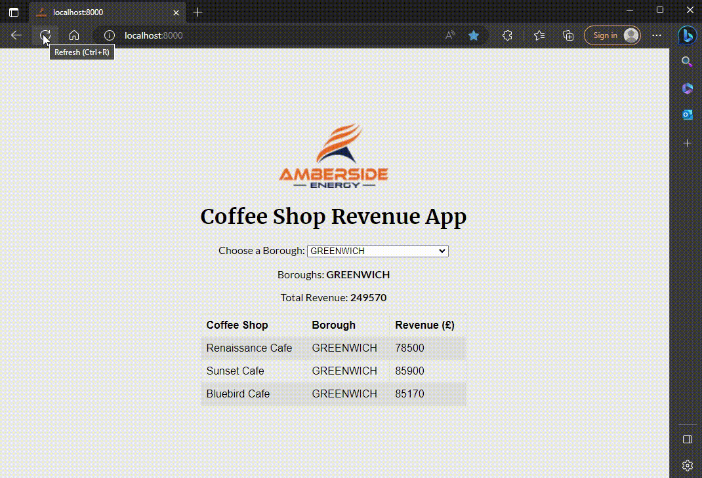

# Amberside Energy Code Test


This is the Amberside Energy Junior Software Engineer candidate code test. The purpose of this test is to measure the Junior Software Engineer problem-solving skills using code. This test is based on an existing simplified project.

What are we measuring?

1. Version control practice using git.
2. Ability to work in a fork-style workflow.
3. Front-end engineering (this will be the main job)
4. Data handling

## Why the Test?

We have API servers running in production and don't have the interface for people to work with the API. __This test is a simplified version of what the job entails__.


## Task

__The Task: Create a dashboard that displays the total of revenues generated by the coffee shops of a selected borough. PLEASE EMPLOY PYTHON (DJANGO, FLASK, etc.) / NODEJS (REACT, SVELTE, etc.) / Vanilla HTML + Javascript where possible__

> Please read the "Problem" section below for more information.

Users should have an interface where they can select one borough from all available boroughs. Once a borough is selected, the app calculates the total revenue of the coffee shops in the selected borough.

Query all the coffee shop's information and total capacity information from the API (localhost). Please follow the "Preparing for the Environment" section to set up the API in localhost.

> Please prioritise the functionality over a "nice" design. Of course it should look nice, but it must function well first.

## Queries About the Test

If you have any queries about the test, please create an "issue" ticket over [here](https://github.com/sutanAE/junior-software-engineer-test/issues).

## Time

__Whilst there is no time restriction, we would recommend spending no longer than one hour on the test__.

## Example

An example is available in the ```/example``` folder. Please use an http server to serve the example. (I created this example in 30 minutes; please don't worry too much about the design at this stage).



## The Problem

London Boroughs have coffee shops. These coffee shops generate revenue. We want to know how each borough performs in the coffee industry.

1. Query the API coffee shop endpoint e.g. ```http://localhost:3000/coffeeshops``` to retrieve all coffee shops data. You can see each coffeeshop has a ```borough``` attribute.
2. Query all borough to ```http://127.0.0.1:3000/allboroughs```.


## Preparing for the Environment

As you already understand the basics of NodeJS, this preparation task should be straightforward.

1. ```fork``` or ```git clone``` this repository. (```fork``` is suggested so you can create ```pull request``` to this repo.)

```bash
$ git clone https://github.com/sutanAE/junior-software-engineer-test.git TEST-FOLDER
```

2. Inside your local repository, install the dependencies in the ```server``` directory. This is the API server that serves the data.

```bash
$ cd TEST-FOLDER
$ cd server
$ npm install
```

3. Run the API server in dev mode
   
```bash
$ npm run dev -- --open # inside /server
```

4. This should run the API server in ```http://localhost:3000/```


## Your Code & Submission

Please put your code in ```/your-code``` directory. Use ```git``` to track what you do. You have 4 options of submitting your work:

1. Add instructions on how to run / view the work. (for example, how to build). Zip everything in root(```/server```, ```/example```, and including the ```/your-code``` that you made) into one zip file and email as an attachment to the recruitment team (people@ambersideenergy.com).

2. Zip your code and upload to a cloud drive service such as Google Drive, Onedrive, etc. and send the link to people@ambersideenergy.com


3. Create a personal github repository containing your code, and send the link to your github repository to people@ambersideenergy.com

4. Create a pull request (this requires the fork workflow) to this repository. This also illustrates your understanding of working with git.

